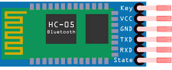
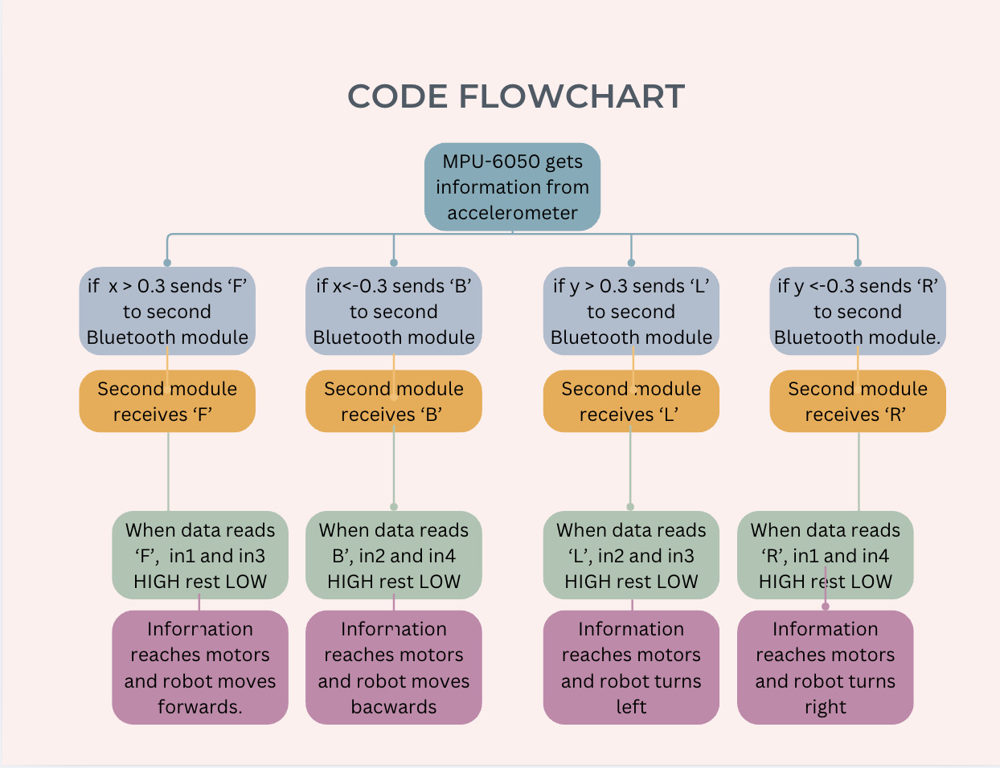

# Gesture Controlled Robot

My project is the Gesture Controlled Robot. The robot is a car that can be controlled with gestures performed on a gauntlet that rests on your hand. Whenever you tilt the gauntlet forwards, backward, right, or left, the robot moves correspondingly. A modification that I added lets me control a robotic arm on the front of the car to pick things up. The arm is slo controlled on the gauntlet, but instead of tilting, it is controlled by joysticks
<!-- You should comment out all portions of your portfolio that you have not completed yet, as well as any instructions: 
<!--```HTML 
<!-- This is an HTML comment in Markdown 
<!-- Anything between these symbols will not render on the published site
```

| **Engineer** | **School** | **Area of Interest** | **Grade** |
|:--:|:--:|:--:|:--:|-->
| Joshua L | Leigh High School | Mechanical Engineering | Incoming Sophomore |

<!--**Replace the BlueStamp logo below with an image of yourself and your completed project. Follow the guide [here](https://tomcam.github.io/least-github-pages/adding-images-github-pages-site.html) if you need help.**-->


  
# Final Milestone

<!-- **Don't forget to replace the text below with the embedding for your milestone video. Go to Youtube, click Share -> Embed, and copy and paste the code to replace what's below.** -->

<!-- <iframe width="560" height="315" src="https://www.youtube.com/embed/F7M7imOVGug" title="YouTube video player" frameborder="0" allow="accelerometer; autoplay; clipboard-write; encrypted-media; gyroscope; picture-in-picture; web-share" allowfullscreen></iframe> -->

<!-- For your final milestone, explain the outcome of your project. Key details to include are: -->
<!-- What you've accomplished since your previous milestone -->
<!-- What your biggest challenges and triumphs were at BSE -->
<!-- A summary of key topics you learned about -->
<!-- What you hope to learn in the future after everything you've learned at BSE -->

# Description 

This is the final milestone of my project, excluding the modifications, and I think it turned out pretty well. Since my previous milestone, I 3D printed cases for my circuit boards to attach them to the base. The reason for this is that they would keep sliding around, and these cases held them in place. Furthermore, I was also able to 3D print a frame that encases the robot. This frame will let me mount my modifications easily and make the whole robot look much neater. 

# Challenges and Triumphs

The biggest challenge I faced during BSE was figuring out how the Bluetooth connection worked. The reason for this was that the Bluetooth connection that I had set up was not working for two whole days, and I did not understand why. I kept on tweaking the code to no avial until I checked the top of my code - the RX TX pins - and realized I had them swapped. After this was fixed, the Bluetooth worked very well, which led to my biggest triumph. Following the Bluetooth's success, I was able to code the rest of the robot's Bluetooth motor movement in one day. This was a big triumph for me because the other day, I was struggling with the Bluetooth to work at all.

# What I Learned at BSE and What I Hope to Learn in the Future

During my time at BSE, one of the most valuable things I learned was how to code using Arduino. Before this camp, I had no prior experience with programming, but now I have a solid understanding of the basics of C++ and a much deeper appreciation for the complexity behind coding projects. I also gained hands-on experience working with components like the L298N motor driver and the HC-05 Bluetooth module. These were completely new to me at the start, but I can now explain the function of each port and how they contribute to the overall performance of my robot. Looking ahead, I hope to improve my coding skills and develop a deeper understanding of how each line of code affects a robot.


# 

Figure 5: Close up of a Bluetooth HC-O5 module

The HC-05 Bluetooth module is a wireless communication device that uses serial (UART) signals to send and receive data between a microcontroller (like an Arduino) and another Bluetooth device, such as a smartphone or computer. It works like a wireless version of a serial cable, allowing two devices to "talk" to each other over Bluetooth instead of through physical wires. When connected, the HC-05 can receive data through its RX pin and send data through its TX pin. The module operates in either master or slave mode, and they can be reconfigured using AT commands when placed in command mode, which allows you to change things like its name, PIN, and connection settings. For example, I used an HC-05 on my robot to allow wireless control through a gauntlet that sent Bluetooth signals. 


Figure 4: Diagram of the L280N in the robot

The L280N has two H-Bridges, which are an electric circuit that allows a DC motor to be driven in both forward and backward directions. This is accomplished by the four switches on the outer parameters of the circuit board. By controlling which switches are on and off, you can easily control the direction the motors spin. For example, if the IN1 and IN3 switches were set to high, and the IN2 and IN4 switches were set to low, then the motors would move forward. Without the help of the L280N, which changes the way the current flows to easily change the polarity of the motor, you would have to manually change the polarity of the DC motor to change the direction it's spinning. I used an L280N, which has two H-bridges, in my robot to control the direction of the four DC motors on the drivetrain and connect the batteries to all the other hardware. Each H-bridge is connected to one pair of motors on each side, which is seen in figure 3 above.

# Second Milestone


<!-- **Don't forget to replace the text below with the embedding for your milestone video. Go to Youtube, click Share -> Embed, and copy and paste the code to replace what's below.** -->

<iframe width="560" height="315" src="https://www.youtube.com/embed/rfFcs0vRWrc?si=0Uea5Bc9E_d-Tqno" title="YouTube video player" frameborder="0" allow="accelerometer; autoplay; clipboard-write; encrypted-media; gyroscope; picture-in-picture; web-share" referrerpolicy="strict-origin-when-cross-origin" allowfullscreen></iframe>

# Description 

Since my first milestone, I have worked on the Bluetooth connection and the code that allows the Bluetooth to control the DC motors. I was able to successfully connect the Bluetooth modules to the motors, and now, by simply tilting the second Bluetooth module, I can move the robot forward, backward, right, and left—as demonstrated in the code at the bottom of the website. During this process, I was surprised by how much easier it became to debug my code once I understood it more thoroughly. Another unexpected realization was that building the hardware for the robot was about three times easier than writing and troubleshooting the software needed to control it.

# Challenges

One of the biggest challenges I faced was accidentally flipping the RX and TX pin connections. Before realizing that this was the issue, I spent a lot of time changing the code and writing separate test scripts to identify the problem. When none of those worked, I finally checked the wiring and discovered that I had swapped the RX and TX pins. After correcting that, I also had to replace two dead batteries because the motors did not have enough power to start consistently. Once those two problems were fixed, the robot functioned properly.


# What's Next?

In the 3rd milestone, I will create holding structures for all my circuit boards so they don't slide around while the robot is moving, while also adding finishing touches such as organizing the wires and making framing for the whole robot to look aesthetically pleasing.




Figure 3: Flow chart of the code that connects gesture motions to motor movement

<!-- For your second milestone, explain what you've worked on since your previous milestone. You can highlight: -->
<!-- Technical details of what you've accomplished and how they contribute to the final goal -->
<!-- What has been surprising about the project so far -->
<!-- Previous challenges you faced that you overcame -->
<!-- What needs to be completed before your final milestone -->

# First Milestone

<!-- **Don't forget to replace the text below with the embedding for your milestone video. Go to Youtube, click Share -> Embed, and copy and paste the code to replace what's below.** -->

<iframe width="560" height="315" src="https://www.youtube.com/embed/OUJAr9vSj64?si=nnV3Ibp3feq13sb9" title="YouTube video player" frameborder="0" allow="accelerometer; autoplay; clipboard-write; encrypted-media; gyroscope; picture-in-picture; web-share" referrerpolicy="strict-origin-when-cross-origin" allowfullscreen></iframe>
<!-- For your first milestone, describe what your project is and how you plan to build it. You can include: -->
<!-- An explanation about the different components of your project and how they will all integrate together -->
<!-- Technical progress you've made so far -->
<!-- Challenges you're facing and solving in your future milestones -->
<!-- What your plan is to complete your project -->

# Description
My main project is the Gesture Controlled Robot, and I plan to finish it in this camp. The project includes two major components - the 4 DC motors for movement and the Bluetooth connections for control. These two components will work together to move the robot around and display the gesture-controlling feature. By this first milestone, I have completed the hardware for the robot along with the code that controls the motor movement. As seen in Figure 1, the hardware includes the drivetrain, Arduino UNO board, L280N board, Bluetooth receiver, and Bluetooth master. The code I implemented coded the motor movement for the robot. I did this by connecting the Arduino UNO and L280N boards to the motors, which allowed me to easily code the movement through the IN1, IN2, IN3, and IN4 ports. I have also connected the two Bluetooth modules - one master and one slave - so they are now ready to code and control the robot. The master module is seen in Figure 2, and the slave module is found in Figure 1.

# Challenges
When configuring the motors for the first time, I realized that one motor on each side was spinning in the wrong direction. At  first, I didn't know what was wrong and tried to change the code, but I realized that I had to change the motor polarity for them to move in the correct direction. So, I flipped the two sets of wires connected to the L280N board and was able to fix the motor polarity. Luckily, this robot has a DC motor that can change polarities easily, unlike other motors such as AC and single-phase.

# What's Next?
To finish this project, I have to code the Bluetooth to control the movement of my robot along with adding some modifications.


# Starter Project (Milestone)

<iframe width="560" height="315" src="https://www.youtube.com/embed/ux6VDJUyapE?si=GVTSBreFM2V7pruh" title="YouTube video player" frameborder="0" allow="accelerometer; autoplay; clipboard-write; encrypted-media; gyroscope; picture-in-picture; web-share" referrerpolicy="strict-origin-when-cross-origin" allowfullscreen></iframe>

# Description

For my starter project, I chose to do the RGB slider. The reason for this is that I want to design headlights and taillights for my gesture-controlled robot that turn on when I move forward or backward. This project provided me with experience in coding LEDs, which will help me make these modifications to my final project. The RGB slider is a small board that contains three RGB sliders, an LED, and a USB-C port. The three RGB sliders control an LED. Three colors - blue, red, and green - are mixed to display different colors on the LED. As you slide the sliders up and down, the strength of the color increases or decreases. There are almost an infinite combinations of colors I can use to light up my LED, and everything on the board is powered by a USB-C that is connected to my laptop. 

# Challenges

Challenges that I faced while making the RGB slider included soldering too much and soldering the whole board upside down. As easy as this project was, I forgot to ask my instructor if I was doing everything on the right side. This made me have to redo the entire RGB slider on the other side of the board. To do this, I unsoldered everything and resoldered it on the other side. 

# What's Next?

The next thing I will do is create my main project - the gesture-controlled robot.

# Schematics of the Hardware on my Gesture-Controlled Robot 
<!-- Here's where you'll put images of your schematics. [Tinkercad](https://www.tinkercad.com/blog/official-guide-to-tinkercad-circuits) and [Fritzing](https://fritzing.org/learning/) are both great resources to create professional schematic diagrams, though BSE recommends Tinkercad because it can be done easily and for free in the browser. -->


Figure 1: Schematic of the Gesture Controlled Robot's hardware - Arduino UNO, L280N, 4 DC motors, 4 AAA batteries, and HC-O5


Figure 2: Schematic of Bluetooth sending module (gauntlet) - HC-O5, MPU 6050, and Arduino NANO

# Bluetooth to Motor movement Code for Milestone 2


```c++

// Bluetooth to motor movement code - robot

#include <SoftwareSerial.h>        //includes library softwareserial

char data;                         //introduces variable DATA

int enA = 5;                       // sets motor pins
int in1 = 6;                       // in1, right top motor, in2 right bottom motor, in3, left top motor, in4, left bottom
int in2 = 7;
int in3 = 8;
int in4 = 9;
int enB = 10;


SoftwareSerial Bluetooth(2, 3);   //(TX , RX)

void setup() {
  Serial.begin(9600);             //begins serial monitor and sets 9600 baud
  Bluetooth.begin(9600);          //begins bluetooth search and sets 9600 baud
  
  pinMode(enA, OUTPUT);
  pinMode(in1, OUTPUT);           // Sets all ports as outputs
  pinMode(in2, OUTPUT);
  pinMode(in3, OUTPUT);
  pinMode(in4, OUTPUT);
  pinMode(enB, OUTPUT);
}

void loop() {
  
  if (Bluetooth.available()) {    // checks bluetooth buffezone 
    data = Bluetooth.read();      // sets variable DATA as bluetooth.read
    Serial.println(data);         // prints said DATA

   if (data == 'F') {             //If the data is F, B, L, R, or S, the motor movement aligns
      driveForward();
    } else if (data == 'B') {
      driveBackward();
    } else if (data == 'L') {
      turnLeft();
    } else if (data == 'R') {
      turnRight();
    } else {
      stopMotors();
    }
  }
}

void driveForward() {
  digitalWrite(in1, HIGH); digitalWrite(in2, LOW); analogWrite(enA, 255);  //Motor movement from in1,2,3,4, pins HIGH or LOW to deterime direction
  digitalWrite(in3, HIGH); digitalWrite(in4, LOW); analogWrite(enB, 255);
}

void driveBackward() {
  digitalWrite(in1, LOW); digitalWrite(in2, HIGH); analogWrite(enA, 255);
  digitalWrite(in3, LOW); digitalWrite(in4, HIGH); analogWrite(enB, 255);
}

void turnRight() {
  digitalWrite(in1, HIGH); digitalWrite(in2, LOW); analogWrite(enA, 255);
  digitalWrite(in3, LOW); digitalWrite(in4, HIGH); analogWrite(enB, 255);
}

void turnLeft() {
  digitalWrite(in1, LOW); digitalWrite(in2, HIGH); analogWrite(enA, 255);
  digitalWrite(in3, HIGH); digitalWrite(in4, LOW); analogWrite(enB, 255);
}

void stopMotors() {
  digitalWrite(in1, LOW); digitalWrite(in2, LOW); analogWrite(enA, 0);
  digitalWrite(in3, LOW); digitalWrite(in4, LOW); analogWrite(enB, 0);
}

// end

```

# Accelerometer Data Code for Milestone 2

``` c++

//Accelerometer Data code - gauntlet code

#include <Wire.h>              // library for I2C communication
#include <SoftwareSerial.h>    // library to use software-defined serial communication

// Set up Bluetooth communication on pins 2 (TX) and 3 (RX)
SoftwareSerial Bluetooth(2, 3); // bluetooth module connected to digital pins 2 and 3

const int MPU = 0x68;          // address of the MPU6050 accelerometer
float AccX, AccY, AccZ;        // variables to store the acceleration values
char lastCommand = ' ';        // to store the last command sent

void setup() {
  Wire.begin();                // starts IC2 communication
  Serial.begin(9600);          // starts Serial monitor communication
  Bluetooth.begin(9600);       // start Bluetooth communication

  // wakes up the MPU6050 by writing 0 
  Wire.beginTransmission(MPU);
  Wire.write(0x6B);            // accesses the power
  Wire.write(0);               // sets it to 0 to wake up the MPU6050
  Wire.endTransmission(true);
}

void loop() {
  // request accelerometer data starting from register 0x3B
  Wire.beginTransmission(MPU);
  Wire.write(0x3B);            
  Wire.endTransmission(false); 
  Wire.requestFrom(MPU, 6, true); // requests 6 bytes (X, Y, Z axes)

  // Combines high and low bytes to get raw acceleration data
  int16_t rawX = Wire.read() << 8 | Wire.read();  
  int16_t rawY = Wire.read() << 8 | Wire.read();  
  int16_t rawZ = Wire.read() << 8 | Wire.read(); 

  // Convert raw values to accx, y, z
  AccX = rawX / 16384.0;
  AccY = rawY / 16384.0;
  AccZ = rawZ / 16384.0;

  char command; // Command to be sent based on tilt

  // Decide which direction to move based on tilt:
  if (AccX > 0.3) 
    command = 'F';            // Tilt forward - Forward
  else if (AccX < -0.3) 
    command = 'B';            // Tilt backward - Backward
  else if (AccY > 0.3) 
    command = 'L';            // Tilt left -  Left
  else if (AccY < -0.3) 
    command = 'R';            // Tilt right - Right
  else 
    command = 'S';            // No tilt - Stop

  // Only send the command if it has changed since last time
  if (command != lastCommand) {
    Bluetooth.write(command);  // send the command to Bluetooth module
    Serial.println(command);   // also print to serial monitor for debugging
    lastCommand = command;     // update the last command
  }

  delay(100);  // Small delay to reduce how often data is sent (every 100 ms)
}
// end 
```

# Motor Movement code for Milestone 1
```c++
// Motor movement code

int enA = 5;
int in1 = 6;
int in2 = 7;
int in3 = 8;
int in4 = 9;
int enB = 10;

void driveforward(){
  digitalWrite(in1, HIGH);
  digitalWrite(in2, LOW);
  analogWrite(enA, 255);
  digitalWrite(in3, HIGH);
  digitalWrite(in4, LOW);
  analogWrite(enB,255);
  delay(1000);
}

void drivebackward(){
  digitalWrite(in1, LOW);
  digitalWrite(in2,HIGH);
  analogWrite(enA,255);
  digitalWrite(in3, LOW);
  digitalWrite(in4, HIGH);
  analogWrite(enB,255);
  delay(1000);
}


void stop(){
  digitalWrite(in1, LOW);
  digitalWrite(in2, LOW);
  digitalWrite(in3, LOW);
  digitalWrite(in4, LOW);
  delay(1000);
}


void setup(){
  Serial.begin(9600);
  pinMode(enA, OUTPUT);
  pinMode(in1, OUTPUT);
  pinMode(in2, OUTPUT);
  pinMode(in3, OUTPUT);
  pinMode(in4, OUTPUT);
  pinMode(enB, OUTPUT);

}

void loop(){
  
  driveforward();
  stop();
  drivebackward();
  stop();

}
```


<!--# Bill of Materials
Here's where you'll list the parts in your project. To add more rows, just copy and paste the example rows below.
Don't forget to place the link of where to buy each component inside the quotation marks in the corresponding row after href =. Follow the guide [here]([url](https://www.markdownguide.org/extended-syntax/)) to learn how to customize this to your project needs.

| **Part** | **Note** | **Price** | **Link** |
|:--:|:--:|:--:|:--:|
| Item Name | What the item is used for | $Price | <a href="https://www.amazon.com/Arduino-A000066-ARDUINO-UNO-R3/dp/B008GRTSV6/"> Link </a> |
| Item Name | What the item is used for | $Price | <a href="https://www.amazon.com/Arduino-A000066-ARDUINO-UNO-R3/dp/B008GRTSV6/"> Link </a> |
| Item Name | What the item is used for | $Price | <a href="https://www.amazon.com/Arduino-A000066-ARDUINO-UNO-R3/dp/B008GRTSV6/"> Link </a> |

# Other Resources/Examples
One of the best parts about Github is that you can view how other people set up their own work. Here are some past BSE portfolios that are awesome examples. You can view how they set up their portfolio, and you can view their index.md files to understand how they implemented different portfolio components.
- [Example 1](https://trashytuber.github.io/YimingJiaBlueStamp/)
- [Example 2](https://sviatil0.github.io/Sviatoslav_BSE/)
- [Example 3](https://arneshkumar.github.io/arneshbluestamp/)

To watch the BSE tutorial on how to create a portfolio, click here. -->
